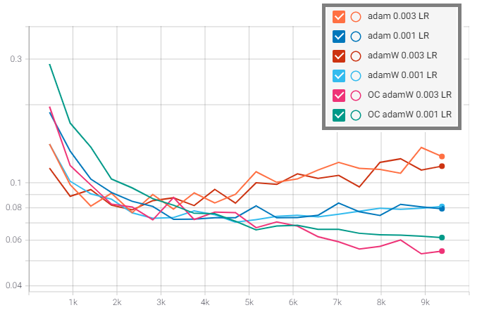

# A Tensorflow 2.3 implementation of AdamW with a One-Cycle learning rate schedule

Based on the results published by S. Gugger and J. Howard here: https://www.fast.ai/2018/07/02/adam-weight-decay/

# Usage
`optimiser = OneCycleAdamW(learning_rate: float, weight_decay: float, cycle_length: int)`
* Learning Rate: the maximum learning rate used at the peak of the cycle. The learning rate will ramp up to this, then decay back down
* Weight Decay: the weight decay to apply. This will follow the same schedule as the learning rate
* Cycle Length: the number of steps to complete the 'One-Cycle' policy over. After 'cycle_length', the learning rate will exponentially decay towards zero.

# Tested with:
* Python 3.8
* tensorflow 2.3
* tensorflow-datasets 4.2.0
* tensorflow-addons 0.12.1
